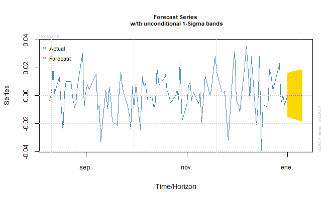
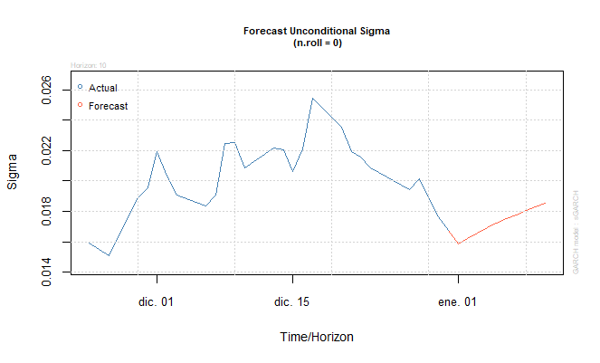

\thispagestyle{empty}

\newpage

\begin{flushright}
\textit{Dedicado para Itzel L.} \\
N.R. \\
\textit{Para mi Familia} \\
M.R \\
\textit{Para mis compañeros y amigos de Universidad} \\
\textit{Para mis compañeros de trabajo} \\
\textit{Para todos los colegas que se \\ encuentran aprendiendo \\ econometría} \\
\end{flushright}

# SERIES FINANCIERAS

\newpage

Las finanzas son una rama de la economía que se enfoca en la gestión del dinero y los recursos financieros. Esta disciplina se ocupa de cómo las personas, empresas y organizaciones utilizan y administran el dinero y otros activos para alcanzar sus objetivos financieros.

Las finanzas comprenden una variedad de actividades, como la inversión, el ahorro, el préstamo, la gestión de riesgos, la contabilidad y la planificación financiera. En general, el objetivo de las finanzas es maximizar el valor de los recursos financieros de una empresa o individuo, ya sea mediante la generación de ingresos o la reducción de costos.

Las finanzas son fundamentales para la economía global, ya que ayudan a canalizar los recursos hacia áreas de mayor crecimiento y a mejorar la eficiencia económica. Las decisiones financieras tienen un impacto significativo en la economía y en la vida de las personas, por lo que es importante contar con conocimientos básicos en finanzas para tomar decisiones informadas y responsables sobre el manejo de los recursos financieros.

Una **serie financiera** es un conjunto de datos financieros que se registran a lo largo del tiempo, generalmente en intervalos regulares, como diarios, semanales, mensuales o anuales. Estos datos pueden incluir información sobre el precio de las acciones, el valor de mercado de una empresa, los ingresos, los gastos, las ganancias, los flujos de efectivo y otros indicadores financieros relevantes.

Las series financieras se utilizan en el análisis financiero para examinar la evolución de los indicadores financieros en el tiempo y detectar patrones y tendencias en el comportamiento financiero de una empresa u otra entidad. Estas series pueden ser utilizadas para hacer proyecciones y tomar decisiones de inversión informadas.

Las series financieras se registran y analizan con herramientas y software especializados, como hojas de cálculo, software de análisis financiero y programas de visualización de datos. Los analistas financieros pueden utilizar técnicas de análisis estadístico para extraer información relevante de las series financieras y presentarla de forma clara y concisa a través de gráficos y tablas.

Las series financieras son una fuente importante de información para la modelización financiera, y los modelos ARCH (Autoregressive Conditional Heteroscedasticity) son una herramienta comúnmente utilizada para analizar y pronosticar la volatilidad en las series financieras.

Los modelos ARCH fueron desarrollados para modelar la volatilidad de las series financieras y se basan en la idea de que la varianza de un valor en una serie financiera puede cambiar a lo largo del tiempo. Los modelos ARCH utilizan información de la varianza pasada para estimar la varianza futura, lo que permite pronosticar la volatilidad de la serie financiera.

Los modelos ARCH pueden ser útiles para la gestión de riesgos financieros, ya que permiten evaluar la incertidumbre asociada con una serie financiera y tomar decisiones informadas sobre la gestión de los riesgos financieros asociados.

* **¿Puedo saber de modelos ARCH sin ser economista?**

Sí, es posible utilizar los modelos ARCH sin ser economista. Sin embargo, para utilizar los modelos ARCH de manera efectiva, se requiere cierto conocimiento y habilidades en estadística y análisis financiero. Es importante comprender los conceptos básicos de la modelización financiera, como la volatilidad, la varianza y la autocorrelación, así como tener experiencia en el manejo de datos financieros y el software de análisis estadístico.

Si bien es cierto que los modelos ARCH son una herramienta comúnmente utilizada por los economistas y otros profesionales de las finanzas, también hay muchos recursos disponibles para las personas que deseen aprender a utilizar estos modelos. Hay cursos en línea, libros y otros recursos que pueden ayudar a las personas a adquirir los conocimientos y habilidades necesarias para utilizar los modelos ARCH y otras técnicas de análisis financiero.

\newpage

## 1. ¿QUÉ ES UN MODELO ARCH?

ARCH (Autoregressive Conditional Heteroscedasticity) es un modelo econométrico que se utiliza para modelar la volatilidad de una serie temporal, es decir, las variaciones en la varianza de la serie temporal a lo largo del tiempo.

El modelo ARCH se basa en la idea de que la varianza de la serie temporal es una función autorregresiva de sus valores pasados al cuadrado, lo que significa que la varianza actual depende de los cuadrados de los residuos pasados.

Un modelo ARCH se utiliza para describir la naturaleza cambiante de la volatilidad en una serie temporal y para predecir futuros valores de la varianza. El modelo es particularmente útil en el análisis financiero, donde la volatilidad es una variable importante para la valoración de los activos financieros y para la gestión del riesgo.

\newpage

## 2. ¿CUÁNDO SE CREARON LOS MODELOS ARCH?

fueron desarrollados por primera vez por el economista estadounidense Robert F. Engle en la década de 1980. En 1982, Engle publicó un artículo titulado "Autoregressive Conditional Heteroscedasticity with Estimates of the Variance of United Kingdom Inflation" en el que presentó el modelo ARCH para modelar la volatilidad condicional de la inflación en el Reino Unido.

En 2003, Engle recibió el Premio Nobel de Economía por su trabajo en el desarrollo de modelos econométricos para analizar la volatilidad de los mercados financieros, incluyendo el modelo ARCH y su extensión, el modelo GARCH (Generalized Autoregressive Conditional Heteroskedasticity).

Desde su introducción, los modelos ARCH y GARCH han sido ampliamente utilizados en la economía financiera para modelar la volatilidad de los mercados financieros y para evaluar el riesgo financiero. También se han utilizado en otros campos, como la econometría, la estadística y la ingeniería.

\newpage

## 3. ¿REALMENTE SIRVEN PARA PRONOSTICAR LOS MODELOS ARCH?

Sí, los modelos ARCH (Autoregressive Conditional Heteroscedasticity) son ampliamente utilizados en la predicción de la volatilidad de los mercados financieros y se ha demostrado que son efectivos para el pronóstico de series bursátiles.

La volatilidad es una medida importante en la valoración de los activos financieros y en la gestión del riesgo. Los modelos ARCH permiten a los inversores y gestores de riesgos evaluar la volatilidad de una serie temporal y tomar decisiones informadas sobre la compra o venta de activos financieros.

Además, los modelos ARCH se han utilizado para desarrollar estrategias de negociación algorítmica y para evaluar el desempeño de los fondos de inversión. En la práctica, los modelos ARCH y sus variantes, como el modelo GARCH (Generalized Autoregressive Conditional Heteroskedasticity), se han utilizado para evaluar y pronosticar la volatilidad en una amplia gama de mercados financieros, incluyendo acciones, divisas, bonos y materias primas.

Sin embargo, es importante tener en cuenta que cualquier modelo econométrico tiene limitaciones y no puede prever con precisión el futuro. Además, los modelos ARCH son modelos estocásticos que requieren la especificación de varios parámetros, por lo que la elección de estos parámetros puede afectar la precisión de las predicciones. Es necesario realizar una evaluación cuidadosa de la adecuación del modelo a los datos y utilizar técnicas adicionales para evaluar el riesgo asociado con las predicciones.

\newpage

## 4. ¿PUEDO HACER USO DE LOS MODELOS ARCH PAARA OBTENER RENDIMIENTOS?

Es posible. Como una herramienta en la toma de decisiones de inversión en el mercado de valores. Sin embargo, es importante tener en cuenta que cualquier modelo econométrico tiene limitaciones y no garantiza ganancias en el mercado de valores.

Los modelos ARCH se utilizan para evaluar la volatilidad de una serie temporal y para predecir futuros valores de la varianza. Si se utilizan correctamente, estos modelos pueden ayudar a los inversores a tomar decisiones informadas sobre cuándo comprar y vender activos financieros.

Sin embargo, los modelos ARCH no son una solución infalible y no pueden predecir con precisión el futuro del mercado de valores. El mercado de valores es altamente impredecible y está influenciado por una variedad de factores externos e internos, incluyendo eventos políticos, cambios en la economía global y la psicología de los inversores.

Por lo tanto, es importante utilizar los modelos ARCH junto con otras técnicas de análisis y herramientas de gestión de riesgos al tomar decisiones de inversión en el mercado de valores. Los inversores también deben tener en cuenta su propio perfil de riesgo y objetivos de inversión antes de tomar cualquier decisión de inversión.

\newpage

## 5. VARIANTES DE LOS MODELOS ARCH

Los modelos ARCH (Autoregressive Conditional Heteroscedasticity) son un tipo de modelo econométrico utilizado para modelar la volatilidad de una serie temporal. A lo largo del tiempo, se han desarrollado varias variantes de los modelos ARCH, cada una con diferentes supuestos y aplicaciones. Algunas de estas variantes incluyen:

1. ARCH (Engle, 1982): El modelo ARCH es el modelo original que introduce la idea de que la varianza de una serie temporal puede ser modelada como una función de sus propios errores cuadráticos previos.
2. GARCH (Bollerslev, 1986): El modelo GARCH es una extensión del modelo ARCH que incluye una componente de media móvil para la varianza condicional. El modelo GARCH permite modelar no solo la volatilidad de la serie temporal, sino también su tendencia.
3. EGARCH (Nelson, 1991): El modelo EGARCH es una extensión del modelo GARCH que permite que los choques positivos y negativos afecten de manera diferente la varianza condicional. Esto puede ser útil en la modelización de series temporales con distribuciones asimétricas.
4. IGARCH (Baillie et al., 1996): El modelo IGARCH es una variante del modelo GARCH que incorpora la posibilidad de que los cambios en la volatilidad sean persistentes a largo plazo.
5. TGARCH (Zakoian, 1994): El modelo TGARCH es una extensión del modelo GARCH que permite que la volatilidad condicional cambie de manera diferente en diferentes estados de la economía. Es útil para modelar series temporales con diferentes regímenes.
6. FIGARCH (Baillie et al., 1996): El modelo FIGARCH es una extensión del modelo IGARCH que incorpora la posibilidad de que la varianza condicional tenga una estructura fractal.
7. NARCH (Hansen, 1994): El modelo NARCH es una variante del modelo GARCH que incorpora la posibilidad de que la varianza condicional tenga una estructura no lineal.

Es importante tener en cuenta que existen muchas otras variantes del modelo ARCH, y que cada modelo tiene sus propios supuestos y limitaciones. La elección de un modelo dependerá de la naturaleza de los datos y de los objetivos del análisis.

\newpage

## 6. DIFERENCIAS ENTRE LOS MODELOS ARCH, VAR Y ARIMA

Los modelos ARCH, VARs y ARIMAs son modelos de series temporales utilizados para analizar y predecir datos de series temporales. A continuación, se describen las principales diferencias entre estos modelos:

1. ARCH (Autoregressive Conditional Heteroscedasticity): El modelo ARCH se utiliza para modelar la varianza condicional de una serie temporal. En particular, el modelo ARCH asume que la varianza condicional de la serie es una función de sus propios errores cuadráticos previos.
2. VAR (Vector Autoregression): El modelo VAR es un modelo que describe la relación entre varias variables en una serie temporal. El modelo VAR es útil cuando se quiere analizar cómo varias variables interactúan entre sí y cómo influyen en la predicción de cada una de ellas.
3. ARIMA (Autoregressive Integrated Moving Average): El modelo ARIMA se utiliza para modelar una serie temporal estacionaria. El modelo ARIMA tiene tres componentes principales: el componente autoregresivo (AR), el componente de media móvil (MA) y el componente integrado (I). El componente AR se refiere a la dependencia de la serie en sus propios valores previos, el componente MA se refiere a la dependencia de la serie en errores previos, y el componente I se refiere a la diferenciación de la serie para convertirla en estacionaria.

Los modelos ARCH se utilizan para modelar la volatilidad de una serie temporal, los modelos VAR se utilizan para modelar la relación entre varias variables en una serie temporal y los modelos ARIMA se utilizan para modelar una serie temporal estacionaria. Cada modelo tiene sus propios supuestos y limitaciones y debe ser elegido en función de la naturaleza de los datos y de los objetivos del análisis.

### 6.1 MODELO ARIMA

Para generar un modelo ARIMA y graficar su serie de tiempo y supuestos en ggplot2, se pueden seguir los siguientes pasos:

1. Cargar los paquetes necesarios:

```{r echo=TRUE, message=FALSE, warning=FALSE, paged.print=FALSE}
library(quantmod)
library(tseries)
library(ggplot2)
library(timeSeries)
library(forecast)
```

2. Cargar los datos y convertirlos en una serie temporal:

```{r}
data <- getSymbols("AAPL", src = "yahoo", 
                   from = "2018-01-01", to = "2022-01-01", 
                   auto.assign = FALSE)
prices <- Cl(data)
returns <- diff(log(prices))
ts_data <- ts(returns, start = c(2018,1), frequency = 252)
```

3. Ajustar el modelo ARIMA:

```{r include=FALSE}
# Se genera el mejor modelo ARIMA
arima_model <- auto.arima(ts_data)

# RESUMEN DEL MODELO
summary(arima_model)
```

```{r, eval=FALSE}
# Se genera el mejor modelo ARIMA
arima_model <- auto.arima(ts_data)

# RESUMEN DEL MODELO
summary(arima_model)
```

```{r, eval=FALSE}
OUTPUT CONSOLE
Series: ts_data 
ARIMA(0,0,1) with non-zero mean 

Coefficients:
          ma1    mean
      -0.1339  0.0014
s.e.   0.0304  0.0006

sigma^2 estimated as 0.0004227:  log likelihood=2483.74
AIC=-4961.47   AICc=-4961.45   BIC=-4946.73

Training set error measures:
                       ME       RMSE        MAE MPE MAPE      MASE
Training set 5.695572e-07 0.02053925 0.01421071 Inf  Inf 0.6300033
                     ACF1
Training set -0.004202937
```

4. Graficar la serie de tiempo y el modelo ARIMA ajustado:

```{r fig.align='center', message=FALSE, warning=FALSE, out.width="80%"}
autoplot(fitted(arima_model), col = "blue") +
  autolayer(ts_data, alpha = 0.5) +
  ggtitle("Serie de tiempo y modelo ARIMA ajustado")
```

5. Verificar los supuestos del modelo:

```{r, out.width = "80%", fig.align='center'}
# Gráfico de los residuos
ggtsdisplay(residuals(arima_model), 
            main = "Gráfico de los residuos del modelo ARIMA")
```


```{r include=FALSE}
# Prueba de normalidad de los residuos
shapiro.test(residuals(arima_model))
```

```{r, eval=FALSE}
OUTPUT CONSOLE
Shapiro-Wilk normality test

data:  residuals(arima_model)
W = 0.93332, p-value < 2.2e-16
```

```{r echo=TRUE, fig.align='center', message=FALSE, warning=FALSE, out.width="80%", paged.print=FALSE}
# Gráfico de densidad de los residuos
ggplot() +
  geom_density(aes(residuals(arima_model)), color = "blue", 
               fill = "lightblue") +
  ggtitle("Gráfico de densidad de los residuos del modelo ARIMA")
```

Estos pasos generan un modelo ARIMA, grafican su serie de tiempo y ajuste, y verifican los supuestos del modelo.

## 7. EJEMPLO DE CREAR UN MODELO ARCH EN `R`

Para generar un modelo ARCH en R desde la librería Quantmod, calcular los retornos de la serie de tiempo, graficar los supuestos del modelo y realizar un análisis predictivo, se pueden seguir los siguientes pasos:

1. Instalar y cargar la librería Quantmod y cargar la serie de tiempo:

```{r message=FALSE, warning=FALSE, include=FALSE, paged.print=FALSE}
# install.packages("quantmod")
library(quantmod)

getSymbols("AAPL", from = "2020-01-01", to = "2022-01-01")
```

```{r echo=TRUE, message=FALSE, warning=FALSE, paged.print=FALSE, eval=FALSE}
# install.packages("quantmod")
library(quantmod)

getSymbols("AAPL", from = "2020-01-01", to = "2022-01-01")
```

```{r echo=TRUE, message=FALSE, warning=FALSE, paged.print=FALSE, eval=FALSE}
OUTPUT CONSOLE
[1] "AAPL"
```

2. Calcular los retornos de la serie de tiempo y graficarlos:

```{r, out.width = "80%", fig.align='center'}
AAPL_return = dailyReturn(AAPL)
chartSeries(AAPL_return)
```

3. Cargar la librería `"rugarch"` para estimar el modelo ARCH:

```{r echo=TRUE, message=FALSE, warning=FALSE, paged.print=FALSE}
# install.packages("rugarch")
library(rugarch)
```

4. Especificar y estimar el modelo ARCH:

```{r}
spec = ugarchspec(
  variance.model = list(model = "sGARCH", garchOrder = c(1,1)),
  mean.model = list(armaOrder = c(0,0), include.mean = FALSE),
  distribution.model = "norm")

fit = ugarchfit(spec, AAPL_return)
```

5. Obtener los resultados del modelo y graficar los residuos:

```{r, eval=FALSE}
# Resumen del modelo
summary(fit)
```

```{r, eval=FALSE}
OUTPUT CONSOLE
Length     Class      Mode 
        1 uGARCHfit        S4 
```


```{r, out.width = "80%", fig.align='center'}
# Graficamos el resultado
plot(fit, which = 1)
```

En la primera línea se muestra un resumen de los resultados del modelo. La gráfica muestra los residuos estandarizados, los cuales se espera que tengan media cero y varianza constante. Si los supuestos del modelo se cumplen, los residuos deben estar aleatoriamente distribuidos alrededor del cero y no deben mostrar patrones o tendencias.

6. Realizar un análisis predictivo:

```{r, eval=FALSE}
# Pronóstico
forecast = ugarchforecast(fit, n.ahead = 10)
plot(forecast)
```




En la primera línea se generan 10 predicciones del modelo ARCH. La gráfica muestra las predicciones del modelo junto con los intervalos de confianza del 95%. Si los supuestos del modelo se cumplen, los intervalos de confianza deben contener los valores observados.

Los modelos ARCH son modelos de series de tiempo que se utilizan para modelar la volatilidad de los retornos. A continuación se presenta un resumen de los modelos ARCH más comunes:

* ARCH: Autoregressive Conditional Heteroskedasticity (Heterocedasticidad Condicional Autoregresiva). Fue propuesto por Robert Engle en 1982 y es uno de los primeros modelos ARCH. Este modelo utiliza los cuadrados de los errores de pronóstico previo para modelar la volatilidad de los retornos.
* GARCH: Generalized Autoregressive Conditional Heteroskedasticity (Heterocedasticidad Condicional Autoregresiva Generalizada). Es una extensión del modelo ARCH que permite incluir términos autorregresivos y de medias móviles en la ecuación de varianza condicional. Fue propuesto por Tim Bollerslev en 1986.
* EGARCH: Exponential GARCH. Es un modelo GARCH que incluye términos de asimetría en la ecuación de varianza condicional. Fue propuesto por Nelson en 1991.
* TGARCH: Threshold GARCH. Es un modelo GARCH que incorpora un umbral o punto de corte en la ecuación de varianza condicional. Fue propuesto por Zakoian en 1994.
* IGARCH: Integrated GARCH. Es un modelo GARCH que utiliza la media móvil integrada autoregresiva para modelar la volatilidad de los retornos. Fue propuesto por Bollerslev en 1996.
* FIGARCH: Fractionally Integrated GARCH. Es un modelo GARCH que permite una fracción de integración en la ecuación de varianza condicional. Fue propuesto por Baillie, Bollerslev y Mikkelsen en 1996.
* NGARCH: Nonlinear GARCH. Es un modelo GARCH que incluye una función no lineal en la ecuación de varianza condicional. Fue propuesto por Higgins y Bera en 1996.
* QGARCH: Quadratic GARCH. Es un modelo GARCH que utiliza un término cuadrático en la ecuación de varianza condicional para modelar la volatilidad de los retornos. Fue propuesto por Sentana en 1995.

Cada modelo ARCH tiene su propia ecuación de varianza condicional y puede ser adecuado para diferentes tipos de series financieras. Es importante tener en cuenta que la elección del modelo apropiado para un conjunto de datos específico puede requerir un análisis cuidadoso y una evaluación de las propiedades de la serie de tiempo.

\newpage

## 8. BIBLIOGRAFÍA

1. Engle, R. F. (1982). Autoregressive conditional heteroskedasticity with estimates of the variance of United Kingdom inflation. Econometrica: Journal of the Econometric Society, 50(4), 987-1008.
2. Bollerslev, T. (1986). Generalized autoregressive conditional heteroskedasticity. Journal of econometrics, 31(3), 307-327.
3. Nelson, D. B. (1991). Conditional heteroskedasticity in asset returns: A new approach. Econometrica: Journal of the Econometric Society, 59(2), 347-370.
4. Zakoian, J. M. (1994). Threshold heteroskedastic models. Journal of economic dynamics and control, 18(5), 931-955.
5. Bollerslev, T. (1996). A conditional heteroskedastic time series model for speculative prices and rates of return. The review of economics and statistics, 58-65.
6. Baillie, R. T., Bollerslev, T., & Mikkelsen, H. O. (1996). Fractionally integrated generalized autoregressive conditional heteroskedasticity. Journal of econometrics, 74(1), 3-30.
7. Higgins, M. L., & Bera, A. K. (1996). A class of nonlinear ARCH models. International Economic Review, 37(2), 437-462.
8. Sentana, E. (1995). Quadratic ARCH models. Review of economic studies, 62(4), 639-661.

* **Artículos en línea:**

1. "ARCH Models: Definition and Overview" por Investopedia: [https://www.investopedia.com/terms/a/arch.asp](https://www.investopedia.com/terms/a/arch.asp)
2. "ARCH Models: What You Need to Know" por ERSO Capital: [https://www.ersocapital.com/arch-models/](https://www.ersocapital.com/arch-models/)
3. "Introduction to ARCH/GARCH Models" por QuantStart: [https://www.quantstart.com/articles/introduction-to-arch-and-garch-models/](https://www.quantstart.com/articles/introduction-to-arch-and-garch-models/)
4. "ARCH Models for Financial Time Series Forecasting" por Machine Learning Mastery: [https://machinelearningmastery.com/arch-models-for-financial-time-series-forecasting/](https://machinelearningmastery.com/arch-models-for-financial-time-series-forecasting/)
5. "ARCH and GARCH Models – The Guide" por Corporate Finance Institute: [https://corporatefinanceinstitute.com/resources/knowledge/trading-investing/arch-and-garch-models/](https://corporatefinanceinstitute.com/resources/knowledge/trading-investing/arch-and-garch-models/)